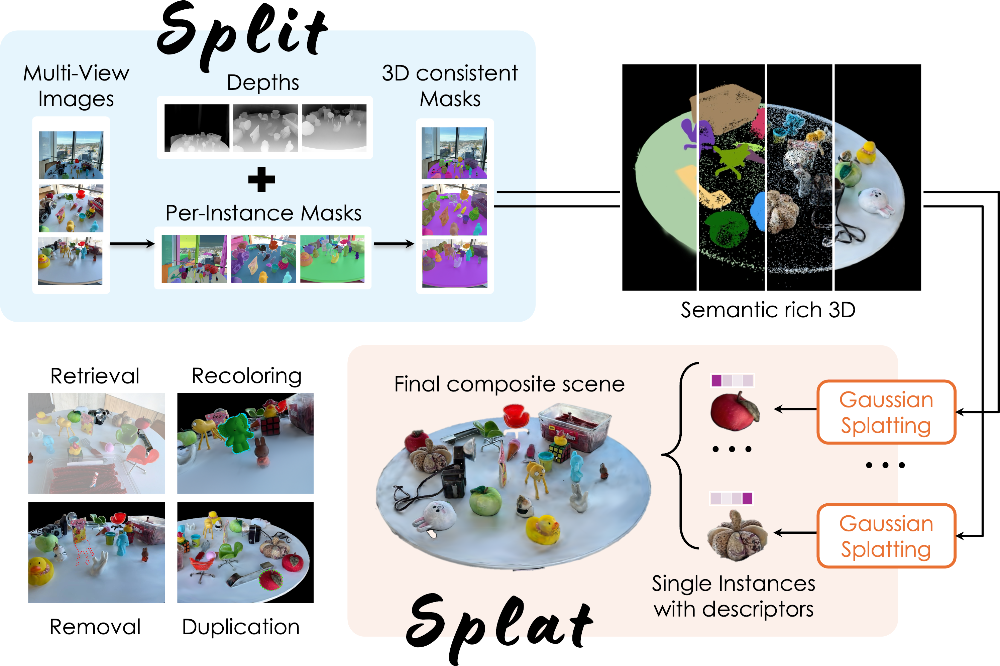

# Split & Splat:  Zero-Shot Panoptic Segmentation via Explicit Instance Modeling and 3D Gaussian Splatting

| [Leonardo Monchieri*](https://leonardomonchieri.github.io/) | [Elena Camuffo*](https://medialab.dei.unipd.it/members/elena-camuffo/) | [Francesco Barbato*](https://medialab.dei.unipd.it/members/francesco-barbato/) | [Simone Milani*](https://medialab.dei.unipd.it/members/simone-milani/) | [Pietro Zanuttigh](https://medialab.dei.unipd.it/members/pietro-zanuttigh/) |

[](https://opensource.org/license/gpl-3-0)



## About

3D Gaussian Splatting (GS) enables fast and high-quality scene reconstruction, but it lacks an object-consistent and semantically aware structure.
We propose **Split&Splat**, a framework for panoptic scene reconstruction using 3DGS. Our approach explicitly models object instances. It first propagates instance masks across views using depth, thus producing view-consistent 2D masks. Each object is then reconstructed independently and merged back into the scene while refining its boundaries. Finally, instance-level semantic descriptors are embedded in the reconstructed objects, supporting various applications, including panoptic segmentation, object retrieval, and 3D editing.
Unlike existing methods, **Split&Splat** tackles the problem by first segmenting the scene and then reconstructing each object individually.

### 1. Installation 

```bash
git clone https://github.com/LTTM/Split_and_Splat.git
cd Split_and_Splat
```

### 2. Create the environment

```bash
conda env create -f requirements.yaml
conda activate split_and_splat
```

### 4. Datasets
For the evaluation of this approach we employed the [ScanNetv2*](http://www.scan-net.org/) and [LERF*](https://www.lerf.io/) dataset.
More in detail for ScanNet we employed the following scenes: _scene0000_, _scene0062_, _scene0070_, _scene0097_, _scene0140_, _scene200_, _scene0347_, _scene0400_, _scene0590_ and _scene645_ (scene selected by __Yanmin Wu and al__ in [OpenGaussians*](https://3d-aigc.github.io/OpenGaussian/). 

#### 4a. Dataset preparation
Already prepared dataset can be found [here*](LINK).
Otherwise follwing step must be accomplished:

1.
2.
3.


### 4. Split


